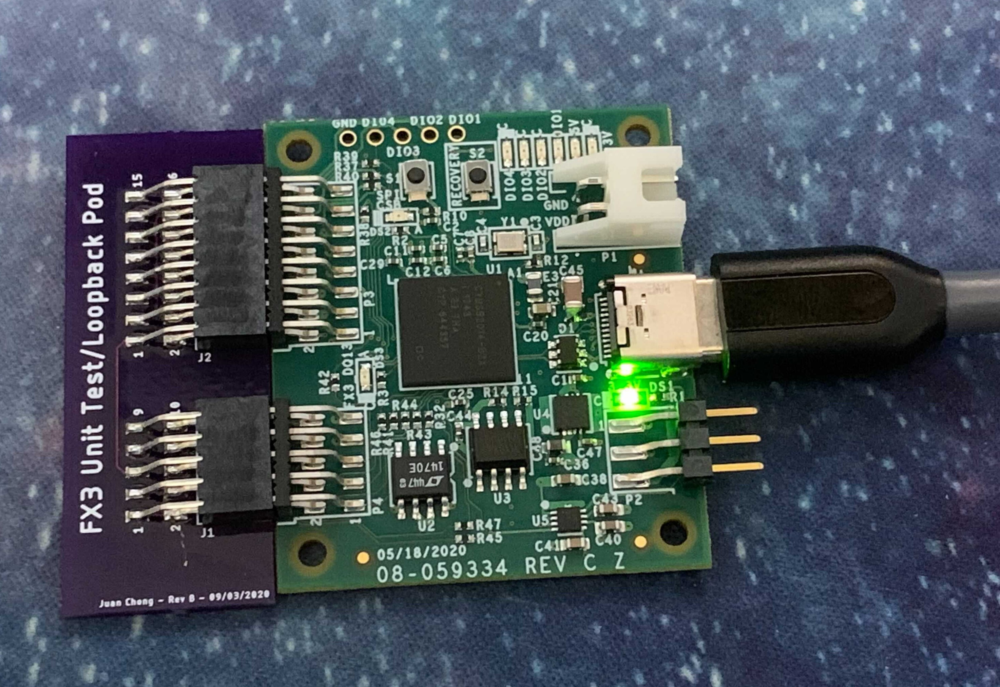

# EVAL-ADIS-FX3 Test Procedure

### Setup

The production test application requires the signed, Analog Devices FX3 driver to be preinstalled on the test system before starting. The drivers are located [here](https://github.com/juchong/iSensor-FX3-API/blob/master/drivers/FX3DriverSetup.exe?raw=true).

Once installed, extract the contents of the latest release archive ([link](https://github.com/juchong/EVAL-ADIS-FX3-Production-Test/releases)) to any folder on the test system (ex: the desktop), and double-click on `EVAL-ADIS-FX3-Prod-Test.exe`

Once the software starts, the main menu should look like this:

### Attaching the loopback pod and USB cable

The test application relies on a loopback pod to be attached to the FX3 board being tested. Care should be taken to make sure the connector is not misaligned or inserted in such a way that it damages the male headers. 

Once the loopback pod is connected, connect the USB-C cable to the FX3 board. 

**Note: The jumper on P2 is not required for testing!**

**Note #2: Only one FX3 board should be connected to the test system at a time!**

### Running the test

The test software will attempt to flash the bootloader image to the onboard EEPROM in the background automatically. **This behavior means that the main window may become unresponsive for one or two seconds. This is normal!**

Once the window becomes responsive again, click on `Start Test` to begin testing. The status window should look like the image below:

The test was successful if the **Test Status** window shows `Passing`.

### Disconnecting the test pod

**Care must be taken to not damage the connectors when removing the test pod!** Applying uneven force to the connector may damage the test pod or FX3 pins. The image below shows an example of a bad disconnection:

