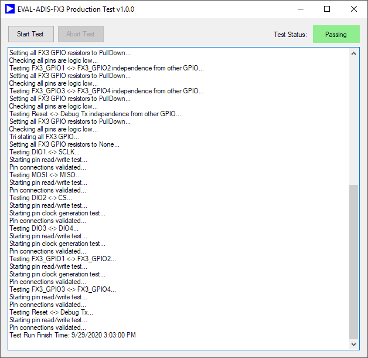

# EVAL-ADIS-FX3 Production Test Application

This application performs first time programming and a basic functional test of the EVAL-ADIS-FX3 IMU evaluation board from Analog Devices.

## Hardware Requirements

In order to operate correctly, this application must be used in conjunction with a EVAL-ADIS-FX3 test mating pod. The mating pod plugs into the two FX3 headers and shorts each pair of digital I/O pins together (including all SPI pins and UART Tx) to enable testing for any shorts/opens. The following table shows the pin connections used to enable testing. Additional details and design files are included in the [hardware](https://github.com/juchong/EVAL-ADIS-FX3-Production-Test/tree/master/hardware) folder in this repository.

| Pin 0     | Pin 1                |
| --------- | -------------------- |
| DIO1      | SPI Clock (SCLK)     |
| DIO2      | SPI Chip Select (CS) |
| DIO3      | DIO4                 |
| Reset     | UART Tx              |
| FX3_GPIO1 | FX3_GPIO2            |
| FX3_GPIO3 | FX3_GPIO4            |

## Test Sequence

The test application currently performs the following steps:

- Initial bootloader loading to NVM (if none is found). This step will detect many potential gross failures in the board including:

- - Errors in NVM
  - Errors in USB connection and enumeration
  - Any errors with the FX3 processor or supply/clock/passive circuitry supplying processor

- Loading application code onto the I2C EEPROM

- NVM error log initialization (clears the log)

- Reboots the board and verifies it correctly re-enumerates using the ADI bootloader (makes sure that bootloader was loaded to NVM correctly)

- Loads the application code again and checks that no initialization errors have been logged by the application firmware

- Each GPIO pair is driven high/low repeatedly and verifies the other GPIO reads the correct logic level. This verifies the connection from the FX3 processor to the connector headers for all digital I/O.

- A 1MHz clock signal is applied to each GPIO pair. The signal frequency and duty cycle are verified using a timer configured for input capture on the other GPIO pin. This test does a better job of catching marginal failures or resistive opens that might not fail at lower frequencies. 

- For each GPIO pair, set one pin logic high and verify all other GPIO can be brought to logic low via a weak pull down resistor. Repeat for opposite polarity. This test will identify any potential shorts between connector pins.

